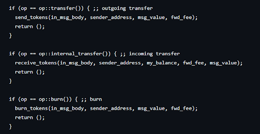
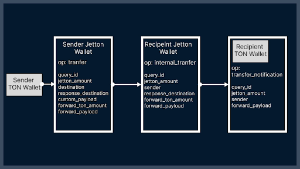
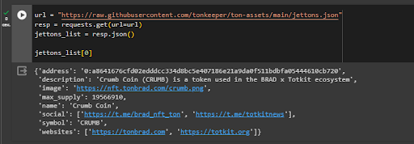
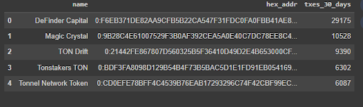

# How to rank Fungible Tokens in the TON blockchain by transactions

## Introduction 

Often in the crypto world, the words decentralization and smart contracts are just a shell for scam or, to put it mildly, dishonest schemes.

Those eager to make money on the waves of hype are faced with the problem of researching and finding projects, which leads them to the need to research the blockchain and collect information.

But the TON blockchain, due to its asynchronous nature and sharding of smart contracts, is difficult to retrieve data; almost any action consists of chains of several interacting smart contracts that send messages to each other. Therefore, using the example of a simple task, I decided to show how the process of searching for the necessary information can be arranged.

At TON, the last couple of months have been all about Tokens, a standard for fungible tokens. Many projects are emerging and some kind of starting point in research is needed.

In this article we will figure out how to find transactions that include the transfer of tokens and rank some of the tokens by the number of transactions. And all this from the perspective of how the process of data excavation can generally be structured.

Disclaimer: This article does not advertise any projects, but only offers insight into collecting data through a blockchain indexer on a small application problem.

### Where will we get the data from?- dton.io 

Dton.io is a blockchain indexer, which means it collects information from each new block into its database. You can make GraphQL queries into this database and thus collect historical information without parsing the entire blockchain.

The two most important sources of dton.io data are the transaction table and a view of the latest state of wallets/accounts on the network. There are also various auxiliary views.

In this tutorial, we will need a table of transactions and a view with a pre-calculated number of certain transactions.

## How to find the necessary transactions

The dton.io indexer allows you to retrieve information using GraphQL queries, and here we have a query fish:

```python
query = """
query MyQuery {

}
"""
```

What to do next? - there are more than a hundred possible arguments. The algorithm is simple in words, complex in details:
We study smart contracts that interest us
Then capture the message chains between contracts that we need
From the two steps above we get the arguments for our request

Let's start with smart contracts.

### What are Jettons?

Jetton is a standard fungible token in the TON network. In order for tokens to be used in other applications (from wallets to decentralized exchanges), standards for smart contract interfaces for tokens are being introduced. The interface in this case is a certain signature - (the syntactic construction of a function declaration.

Smart contract standards require public discussion. In TON it happens here - https://github.com/ton-blockchain/TEPs/blob/master/text/0074-jettons-standard.md

The basic logic is written inside, and there is also some simple implementation.

### Consider the Token standard

We will not analyze the Jetton standard in detail, since I have a separate article about it -
https://github.com/romanovichim/TonFunClessons_ru/blob/main/lessons/smartcontract/9lesson/ninthlesson.md. Let us note the key ideas at this stage:

Token standard The token must consist of two types of smart contracts:

master contract
contract wallet

Each Token has a main smart contract (we'll call it a master contract), which is used to mint new Jettons, account for the total supply, and provide general information about the token.

Information about the number of tokens owned by each user is stored in smart contracts called Jetton wallet.


### Internal transfer

After the initial familiarization with smart contracts, you need to pay attention to op codes - this is the code that displays what the smart contract should do.



After a quick look at the op codes, you need to identify those that suit your task and draw the process. Let's look at the process:

1. sender sends an op::transfer message to its jetton wallet
2. sender_jetton_wallet reduces the token balance
3. sender_jetton_wallet sends an op::internal_transfer message to the recipient's jetton wallet
4. recipient_jetton_wallet increases its token balance
5. recipient_jetton_wallet sends op::transfer_notification to its owner (recipient ton wallet)

* there is also an excess return, but we will omit this within the article, I suggest the reader familiarize himself with the standard

After this, for convenience, we will draw the process of sending Jettons:



Judging by this scheme, we need internal transfer; it is messages with internal transfer that will allow us to collect the sending of Jettons from wallet to wallet.

For more complex chains of contracts, it is also important to specify what data is transmitted internally, since not every message carries information about a certain business transaction - more often than not, only the required minimum. This is especially relevant for DEX. Once again, at this stage we are looking for transactions that allow us to collect the necessary information.

## Collecting information about one Jetton

After we have determined the necessary transactions, we will reduce the task to the minimum - in our case, this is searching for information about one Jetton.

For your research, I suggest the following rule of thumb - reduce the task until it can be checked in Explorer. That is, when you run a query, you can find the transaction and understand whether you found the correct information.

Let's denote the endpoint dton.io (all the code from this tutorial will be available at the end in Google Colab):

```python
endpoint = 'https://dton.io/graphql/'
```

Let's create an empty request:

```python
query = """
query MyQuery {

}
"""

response = requests.post(endpoint, json={'query': query})

if response.status_code == 200:
  data = response.json()['data']
  print(data)
else:
  print(response.json())
```

For our goal - counting the number of Jetton transactions, there is a convenient representation of lastTransactionCountSegments that we will use. Inside we will put the required op_code - internal transfer and the address of the master contract of any token (since this is not an advertising article, I won’t say what kind of token it is, if you want to try some other token, you can get it here - the links immediately contain hex address format https://tonlearn.tools/#/jetton-dash).

In this case, we can take op_code directly from the standard to convert it from bytes to 32-integer, we will use this site: https://cryptii.com/pipes/integer-encoder

So:

```python
endpoint = 'https://dton.io/graphql/'

query = """
query MyQuery {
  lastTransactionCountSegments(
    parsed_jetton_wallet_jetton_address_address: "F4BDD480FCD79D47DBAF6E037D1229115FEB2E7AC0F119E160EBD5D031ABDF2E"
    in_msg_op_code: 395134233
      segmentation: "day"
      days: 30) {
    segment
    cnt
  }
}
"""

response = requests.post(endpoint, json={'query': query})

if response.status_code == 200:
  data = response.json()['data']
  print(data)
else:
  print(response.json())
```

Now that we have learned to collect information from one token, we can move on.

## Let's move on to ranking

### List of Jettons

To have something to rank, you need some list of master contracts of Jettons; it could be collected by simply making queries into the table of contract states on the network - account_states. But this makes little sense - we will get a huge list of Jettons, some of which will have a maximum of 1 - 2 transactions. Therefore, I propose a simple method, take addresses from the public list of Gettons, which one of the popular wallets on TON displays in its interface:

```python
url = "https://raw.githubusercontent.com/tonkeeper/ton-assets/main/jettons.json"
resp = requests.get(url=url)
jettons_list = resp.json()

jettons_list[0]
```


It is important to note that this is an open source list and there are errors in it, for example, sometimes addresses are stored in different formats. Therefore, when constructing the next query, we will need to clean out the unnecessary.

### Constructing the request

To collect information in the context of Jetton, you just need to concatenate queries:

```python
formatted_query_cnt =""

for token in jettons_list:
  # if not hex skip
  if(token['address'].upper()[0:2]!='0:'):
    #print(token['address'].upper()[0:2])
    continue
  #cut workchain from address
  temp_addr = token['address'].upper()[2:]
  template = string.Template("""
    seq${addr_cut}: lastTransactionCountSegments(
      in_msg_op_code: 395134233
      segmentation: "day"
      days: 30
      parsed_jetton_wallet_jetton_address_address: ${addr_dop}
    ) {
      segment
      cnt
    }
  """)

  formatted = template.substitute(addr_cut = temp_addr,addr_dop= '"'+temp_addr+'"')
  formatted = formatted +"\n"
  formatted_query_cnt += formatted


formatted_query = """query {"""+formatted_query_cnt+"""}"""
response_cnt = requests.post(endpoint, json={'query': formatted_query})
response_cnt
```
The concatenation limit is 100, but in my experience, it is important to evaluate how complex the computable query is and go from there.

### Sort and discuss the results

Afterwards, we will collect and sort the data, I will not add this code to the article, everything is in Google Colab:

https://colab.research.google.com/drive/1h6fFy2OaTntlUXNKJLaVztuOGH-A_NIg?usp=sharing

The result is something like this:



I note that this is a training task; it is quite difficult to rank Jettons by transactions applicable to real tasks, since many Jettons increase the volume of transactions on the DEX and such transactions need to be cleaned out.

## Conclusion

I like the TON blockchain for its technical elegance; at least it’s not another copy of Ethereum, which is being overclocked with the help of a lot of capital without looking back, and in general why the user needs it. If you want to learn more about the TON blockchain, I have open source lessons that will teach you how to create full-fledged applications on TON.

https://github.com/romanovichim/TonFunClessons_ru

I post new tutorials and data analytics here: https://t.me/ton_learn

Code for this tutorial

https://colab.research.google.com/drive/1h6fFy2OaTntlUXNKJLaVztuOGH-A_NIg?usp=sharing

