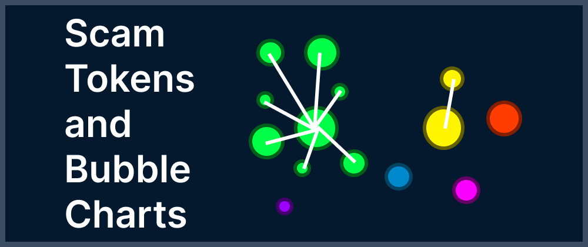
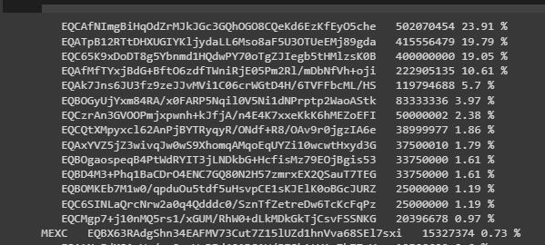
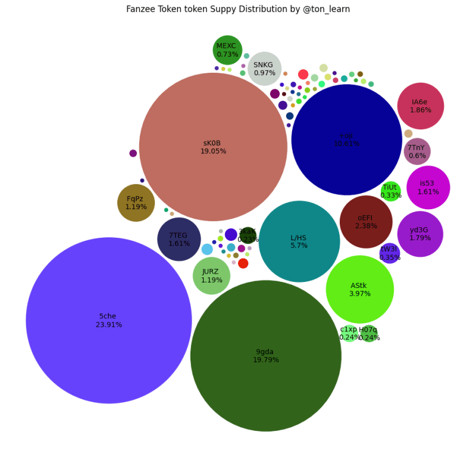

# Looking for scam tokens using bubble charts in TON blockchain || Top Jetton holders



Looking for scam tokens using bubble charts in TON blockchain

Often in the crypto world, the words decentralization and smart contracts are just a shell for scam or, to put it mildly, dishonest schemes.

You can hear Do Your Own Research - do research, but an ordinary person, not a venture capital firm with a staff of analysts, cannot spend so much time on analysis.

## What can be done?

Without canceling DYOR, we can try to find an indicator/dashboard that, with 20% of the effort to study, will give 80% of the result - information about the token.

What kind of indicator? - I propose to consider the distribution of the supply of tokens.

Let's look at the cases:

1) Manipulations with floor and NFT volume

NFT buyers often focus on floor (the lowest price of a collection) and collection volume - dishonest sellers influence these indicators by reselling NFTs between a pair of wallets.

If you display resales on a dashboard relative to the overall distribution, such manipulations will be immediately visible.

2) Concentration of 25% of fungible tokens in one hand

The creators of tokens often flaunt a large number of token transactions, look, they use our token, although often it is simply transferring tokens between a pair of interconnected wallets - the token ecosystem is active, but the real owner is actually one...

3) Fake DAOs

An important part of a DAO is voting management - it is important to understand whether the voting will be real or just legitimizing the decisions of a couple of people. If a couple of people own almost the entire supply, it is not a DAO.

You will say, this is certainly cool, but going through a bunch of wallets will take a lot of time…

## Bubble charts come into the picture

The best way to visualize token distribution is with a bubble chart; this will allow you to quickly see suspicious patterns.

In this tutorial we will put together a script that will chart the top 100 wallets by balance for any Jetton in the TON blockchain!

In the next tutorial we will take these top 100 wallets and find transactions among them, thus highlighting the clusters.

The script will be in python, the data will be taken from the dton.io indexer. We will focus on obtaining data.

The result will be a Google Colab that you can use in your research.

## How to collect data from the TON blockchain?

Dton.io is a blockchain indexer, which means it collects information from each new block into its database. You can make GraphQL queries into this database and thus collect historical information without parsing the entire blockchain.

The two most important sources of dton.io data are the transaction table and a view of the latest state of wallets/accounts on the network. Make queries in this view and table, you can collect almost any information.

In this tutorial, the states of the wallets will be useful to us; based on the state, we will determine whether there are tokens

## Install dependencies

As we know, GraphQL requests are sent in the body of an HTTP POST request, so let’s install requests and other necessary dependencies:

```python
# install requriments
!pip install requests
!pip install matplotlib 

import requests
import string
from collections import Counter
import string
import json
```

Let us also denote the endpoint dton.io:

```python
endpoint = 'https://dton.io/graphql/'
```

## Get the contract type and information about the token.

For our script to work, we need a master contract of a fungible token for TON. We will discuss what this is below. But since I want to make Colab easy to use, I first need to learn how to check that the entered address is exactly what is needed.

There are many options for this, you can, for example, take all the information from the network - take the low-level code of the contract and compare it with the requirements of the fungible token standard, but there are simpler options.

The simplest option, where with one request we can check what kind of contract it is by address and immediately get information about the token, is the option to make a request in toncenter - this is the HTTP API for The Open Network. Toncenter has /getTokenData for this:

```python
#Note api has limits
API_ENDPOINT = 'https://toncenter.com/api/v2'
payload = {'address': master_addr}
r = requests.get(API_ENDPOINT+'/getTokenData', params=payload)
#print api response
print(json.dumps(r.json(), indent=2))

# Token supply
total_supply = r.json()['result']["total_supply"]

# Token name for our future diagram
token_name = r.json()['result']["jetton_content"]["data"]["name"]
```

In the resulting result, from the “contract_type” field you can understand what type of smart contract it is (if such a type is supported by the service).

## Constructing a request in dton.io

Now we know for sure that the address entered by the user is the address of the master contract, it’s time to talk about the standard of fungible tokens.

In the TON blockchain there is no single smart contract that stores a list of addresses of the owning tokens and their balances. Instead, sharding of smart contracts is used - there is a master contract that stores information about the token and contract wallets - for each owner of the token, one is created.

We will not dwell in detail on the sharding of tokens in TON in this article; if you are interested in this, I offer you an analysis of smart contracts of the standard - ENG LINK.
https://github.com/romanovichim/TonFunClessons_Eng/blob/main/lessons/smartcontract/9lesson/ninthlesson.md

Since the use of a smart contract requires “payment for the work” of TVM in gas (part of the TON for any transaction goes as a commission), this makes such a standard extremely economical - there is no need to search in a huge list of addresses.

But if there are pros, then there are also cons.

## The problem of smart contract sharding from the point of view of data collection

Sharding saves gas, but there is no list of owners - then how to get all the addresses of the token owners? The only option is to run through all the blocks and find the addresses we need. But fortunately, there are blockchain indexers that allow us to get the addresses we need with a couple of queries.

In the dton.io we already mentioned, there is a representation of the latest state of wallets/accounts on the network. Accordingly, we need to add restrictions to the request of this view that will allow us to display the top 100 wallets.

## Collecting a request in dton.io

Dton.io not only indexes the blockchain, but also enriches the data. It is important for us that in the representation of accounts on the network there is a field parsed_jetton_wallet_jetton_address_address - for token wallets this field is filled in with their master contract, which is what we will use. To sort only contracts and token wallets, let’s check that the contract has a get_wallet_data method (this method is required for token wallets according to the standard).

```python
query MyQuery {
  account_states(
    account_state_state_init_code_has_get_wallet_data: 1
    parsed_jetton_wallet_jetton_address_address: "${addr}"
    workchain: 0


  ) {


  }
}
```

Let's sort by balance and select the first 100 records on the page.


```python
query MyQuery {
  account_states(
    account_state_state_init_code_has_get_wallet_data: 1
    parsed_jetton_wallet_jetton_address_address: "${addr}"
    workchain: 0
    order_by: "parsed_jetton_wallet_balance"
    order_desc: true
    page_size: 100
  ) {
  }
}
```
All that remains is to specify that we want to get the address of the owner of the token wallet and its balance. We get:
```python
query MyQuery {
  account_states(
    account_state_state_init_code_has_get_wallet_data: 1
    parsed_jetton_wallet_jetton_address_address: "${addr}"
    workchain: 0
    order_by: "parsed_jetton_wallet_balance"
    order_desc: true
    page_size: 100
  ) {
    address
    parsed_jetton_wallet_balance
    parsed_jetton_wallet_owner_address_address
  }
}
```

## How to enrich data

I think you understand that exchanges or service smart contracts can have many outgoing transactions, it would be cool to mark them so as not to consider that anything is a scam, because people simply exchange tokens through the exchange. But where to get the necessary base? Let's start from the problem of who needs such a dataset most of all - of course, wallets, because it will also give them UX - it is convenient for users to see who is sending them funds, for example + plus this is some protection against spam - if the token is not in the whitelist, then perhaps it is a scam or advertising sending of a token (they throw a token and in the message there is a link somewhere).

Therefore, let’s pay attention to the open source lists from the tonkeeper wallet:

https://github.com/tonkeeper/ton-assets

Of course, these are not all possible combinations of wallets and their owners, and one owner may have many wallets, but it’s better than nothing.

After enrichment, we will see that a small share of the token is owned by the MEXC exchange:



## Bubble chart

All that remains is to build a diagram, prepare random colors (code below in the link) and get:



## But can scammers use multiple wallets?

Yes, and that is why in the second part we will track transactions between the top 100 wallets and collect clusters.

## Conclusion

I like the TON blockchain for its technical elegance; at least it’s not another copy of Ethereum, which is being overclocked with the help of a lot of capital without looking back, and in general why the user needs it. If you want to learn more about the TON blockchain, I have open source lessons that will teach you how to create full-fledged applications on TON.

https://github.com/romanovichim/TonFunClessons_Eng

I post new tutorials and data analytics here: https://t.me/ton_learn

Code from this tutorial: https://colab.research.google.com/drive/10qv2AN68F3IOwfJyLXsDiQenOhBvyN6I?usp=sharing

